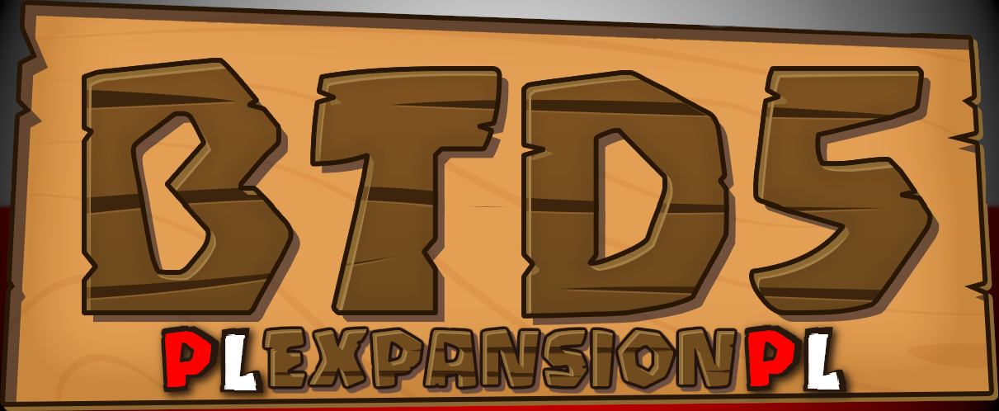

[*English readme here*](https://github.com/GerbilPL/BTD5EPL/blob/main/README_EN.md)
# Bloons Tower Defence 5 Expansion - Spolszczenie

### Wstęp

Witaj w repozytorium BTD5EPL! 
Tutaj możesz znaleźć wszystko na temat polskiego tłumaczenia modyfikacji BTD5. 

Jeżeli jesteś zainteresowany plikami do pobrania, przejdź do zakładki "Releases"/"Wydania" obok lub [kliknij tutaj](https://github.com/GerbilPL/BTD5EPL/releases). 
Instrukcje znajdują zarówno w pobranym archiwum ZIP oraz [tutaj](https://github.com/GerbilPL/BTD5EPL/blob/main/Expansion%2012/readme.txt). 

Postęp w tłumaczeniu znajdziesz [tutaj](https://github.com/GerbilPL/BTD5EPL/blob/main/docs/progress.md).

Masz pytania? Napisz do nas na Discordzie lub na dyskusjach repozytorium.
### Kontakt

[Dyskusje repozytorium](https://github.com/GerbilPL/BTD5EPL/discussions) 
[Serwer Discord **Shaiko's BTD5 Modding Server**](https://discord.gg/WSFfYCY6zQ)

Pinguj moją rolę: `<@&1266850596867276851>` (skopiuj i wklej) 
Pinguj mnie: @gerbilpl 
Lub zapytaj Shaiko o informacje. 

### Zasługi:

Shaiko - modyfikacja BTD5 Expansion, czcionki i pomoc 
GerbilPL - tłumaczenie na język polski 
pelletsstarPL - pomoc w tłumaczeniu 
cosmo - pomoc w tłumaczeniu  

### FAQ - Często zadawane pytania
*Jeszcze nie wiem jak często, ale przygotuję przynajmniej parę odpowiedzi na przyszłość.*   

> Skąd mam wiedzieć które wydanie pobrać z zakładki Releases/Wydania?

Wystarczy pobrać pliki z wydania z najnowszą dostępną datą. Upewnij się że pobrana wersja wspiera wersję gry i modyfikacji którą posiadasz.  

> Czemu napisy są w złych miejscach?

Najczęściej dzieje się tak gdy gra się zaktualizuje. Możesz sprawdzić to na steam bądź w ustawieniach gry. Wystarczy wtedy sprawdzić czy BTD5 Expansion i tłumaczenie zostało zaktualizowane.  

> Gra mi crashuje po pobraniu modyfikacji/tłumaczenia!

Jeżeli gra crashuje na modyfikacji bez naszego tłumaczenia to pewnie nie zostały pobrane wszystkie pliki lub modyfikacja jest stara. W przypadku tłumaczenia może to być symptomem niezaktualizowanego tłumaczenia.  

> Czy mogę poprawić/pomóc w tłumaczeniu?

Tak! Jeżeli często używasz GitHuba to wiesz jak zrobić pull request'a. Jeżeli nie znasz GitHuba to napisz do mnie lub do Shaiko na discordzie.

Pamiętaj aby ilość linijek była taka sama! (Najlepiej skontaktuj się z nami!)
