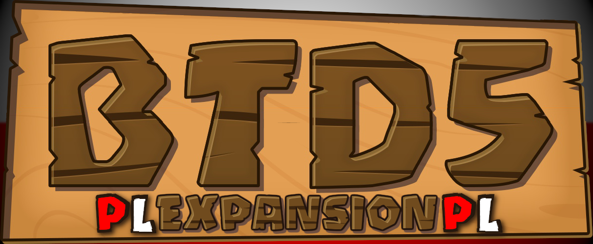

[*Polskie readme tutaj*](https://github.com/GerbilPL/BTD5EPL/blob/main/README.md)

*idk why i am making an english readme lol*
# Bloons Tower Defence 5 Expansion - Translation

### Introduction

Welcome to the BTD5EPL repository! 
Here you can find everything about the Polish translation of the BTD5 mod. 

If you are interested in downloading the files, go to the "Releases" tab next to this page or [click here](https://github.com/GerbilPL/BTD5EPL/releases).  
Instructions are available both in the downloaded ZIP archive and [here](https://github.com/GerbilPL/BTD5EPL/blob/main/Expansion%2012/readme.txt). 

You can find the progress of the translation [here](https://github.com/GerbilPL/BTD5EPL/blob/main/docs/progress_en.md).

Got questions? Write to us on Discord or in the repository discussions.
### Contact

[Repository Discussions](https://github.com/GerbilPL/BTD5EPL/discussions) 
[Discord Server **Shaiko's BTD5 Modding Server**](https://discord.gg/WSFfYCY6zQ)

Ping my role: `<@&1266850596867276851>` (copy and paste) 
Ping me: @gerbilpl 
Or ask Shaiko for information. 

### Credits:

Shaiko - BTD5 Expansion mod, fonts, and assistance 
GerbilPL - Polish translation 
pelletsstarPL - Translation assistance 
cosmo - Translation assistance (pending)  

### FAQ - Frequently Asked Questions
*I’m not sure how often, but I’ll prepare at least a few answers for the future.*  

> How do I know which release to download from the Releases tab?

Just download the files from the release with the latest available date. Make sure the version you downloaded supports the game and mod version you have.  

> Why is some text in the wrong places?

This usually happens when the game updates. You can check this on Steam or in the game settings. In that case, just check if the BTD5 Expansion and the translation have been updated.  

> My game crashes after downloading the mod/translation!

If the game crashes with the mod without translation, then some files might not have been downloaded or mod is outdated. In the case of the translation, it might be a symptom of an outdated translation files.  

> Can I improve/help with the translation?

Yes! If you frequently use GitHub, you know how to make a pull request. If you’re not familiar with GitHub, message me or Shaiko on Discord.

Make sure that line number is the same! (Best course of action is to contact us!)
